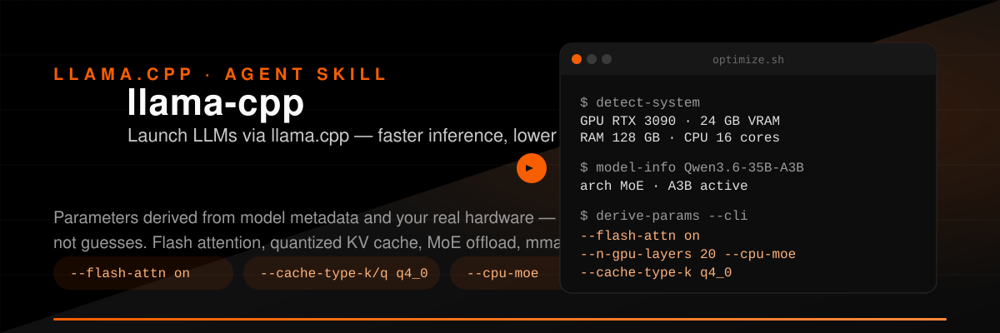

# llama-cpp-optimizer

<p align="center">
  
</p>

Launch optimized LLMs via [llama.cpp](https://github.com/ggml-org/llama.cpp) — parameters derived from your **model metadata** and **system capabilities**, not guesses.

This repository hosts the **`llama-cpp-optimizer`** Agent Skill: a pipeline that detects your GPU/RAM/CPU, fetches model architecture from Hugging Face, and outputs optimal `llama-cli` / `llama-server` arguments. Includes memory-reduction hacks — flash attention, KV-cache quantization, MoE CPU offload, memory-mapping, and layer offloading.

---

## What it is

A three-script CLI that turns raw hardware specs + model info into ready-to-run llama.cpp commands:

1. **`detect-system.py`** — probes GPU, RAM, CPU cores
2. **`model-info.py`** — fetches architecture metadata from Hugging Face
3. **`derive-params.py`** — computes optimal flags and emits `--cli` args

All scripts run via `uv run` with inline dependencies — no manual setup.

## Quick Start

**Prerequisites:** [uv](https://docs.astral.sh/uv/) and a llama.cpp build on `PATH`.

```bash
# 1. Detect your hardware
uv run scripts/detect-system.py

# 2. Fetch model metadata
uv run scripts/model-info.py Qwen/Qwen3.6-35B-A3B

# 3. Derive CLI args (pipe model info into parameter derivation)
uv run scripts/model-info.py Qwen/Qwen3.6-35B-A3B \
  | uv run scripts/derive-params.py --model - --cli
```

**Run with derived parameters:**

```bash
llama-cli --hf-repo <user>/<model> --hf-file <file.gguf> \
  $(uv run scripts/model-info.py <model> \
    | uv run scripts/derive-params.py --model - --cli) \
  --conversation --color auto
```

## Optimizations

| Technique | Effect |
|-----------|--------|
| `--flash-attn on` | Faster attention, lower memory (esp. long contexts) |
| `--cache-type-k/v q8_0/q4_0` | Quantized KV cache → lower VRAM |
| `--cpu-moe` / `--n-cpu-moe N` | MoE expert weights in CPU RAM → fit larger models |
| `--load-mode mmap` | Memory-mapped model file → lower RAM, faster load |
| `--n-gpu-layers N` / `--tensor-split` | Optimal GPU offloading / multi-GPU distribution |

See [SKILL.md](skills/llama-cpp-optimizer/SKILL.md) for full workflow, flag reference, and run examples.

## Scripts

| Script | Purpose | Usage |
|--------|---------|-------|
| `detect-system.py` | Detect GPU/RAM/CPU | `uv run scripts/detect-system.py` |
| `model-info.py` | Fetch model metadata from HF | `uv run scripts/model-info.py <model_id>` |
| `derive-params.py` | Derive optimal llama.cpp parameters | `uv run scripts/derive-params.py --model -` |

All use inline dependencies (`# /// script` header) and run via `uv run` — no manual dependency management.

## References

- [SKILL.md](skills/llama-cpp-optimizer/SKILL.md) — Full workflow and usage guide
- [llama-cli-reference.md](skills/llama-cpp-optimizer/references/llama-cli-reference.md) — CLI reference for all llama.cpp tools
- [hf-model-info.md](skills/llama-cpp-optimizer/references/hf-model-info.md) — Retrieving model metadata from Hugging Face
- [system-capabilities.md](skills/llama-cpp-optimizer/references/system-capabilities.md) — Detecting local system capabilities
- [parameter-tuning.md](skills/llama-cpp-optimizer/references/parameter-tuning.md) — Derivation logic
- [moe-optimization.md](skills/llama-cpp-optimizer/references/moe-optimization.md) — MoE-specific optimization guide

## Layout

The project follows the [Agent Skills](https://agentskills.io) spec:

```text
skills/llama-cpp-optimizer/
├── SKILL.md
├── scripts/
│   ├── detect-system.py
│   ├── model-info.py
│   └── derive-params.py
└── references/
    ├── llama-cli-reference.md
    ├── hf-model-info.md
    ├── system-capabilities.md
    ├── parameter-tuning.md
    └── moe-optimization.md
```

## License

MIT — see [LICENSE](LICENSE).
